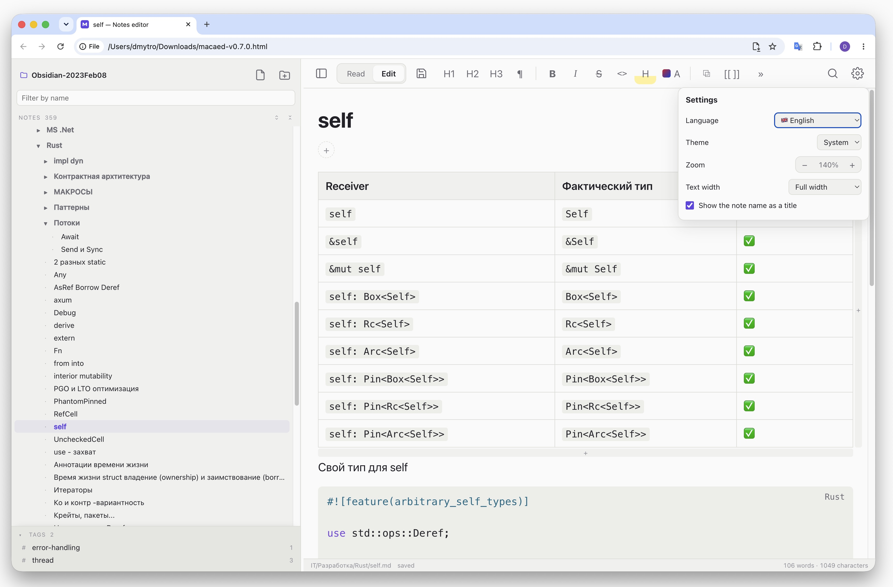

# markdown-catalog-editor

A Markdown editor for a local folder of notes — in the spirit of Obsidian, but entirely
contained in one standalone HTML file. No network is used: files are read from and saved to
disk directly.

**[Online demo](https://marketkernel.github.io/markdown-catalog-editor/)** — the same editor,
installable as an app and working offline. Your notes stay on your disk there too.



```
┌──────────────────────────────────────────────┐
│ Toolbar                                      │
├────────────┬─────────────────────────────────┤
│ File and   │ #tags +                         │
│ folder     │ Document                        │
│ tree       │ (read / edit)                   │
├╌╌╌╌╌╌╌╌╌╌╌╌┤                                 │
│ Tags       │                                 │
└────────────┴─────────────────────────────────┘
```

## How to use

1. Build `build/macaed.html` (see "[Build](#build)") and open it in a browser.
2. "Open folder" → pick a folder with `.md` files. You can also just drag the folder into
   the window.
3. The **Read / Edit** switch at the top, or `⌘E`.

In Chrome, Edge and Arc the folder is opened through the File System Access API: notes are
read and written in place, and creating, renaming and deleting files and folders all work.
In Safari and Firefox the folder opens read-only, and `⌘S` offers to download the modified
file.

If you put `macaed.html` next to your notes and serve it over HTTP, the page picks the folder
up by itself — provided an `index.json` sits alongside it, of the form
`{ "name": "Notes", "files": ["Note.md", "Folder/Other.md"] }`.

## Live preview

In edit mode the document stays formatted, and only the block the caret sits in turns into
raw Markdown. A block is a paragraph, a heading, a whole list, a code block or a quote: a
list does not fall apart line by line. Tables are edited differently — see
"[Tables](#tables)".

The source line keeps the font size, weight and line height of the formatted one, so the text
does not jump: `# Heading` is shown at heading size. This is checked automatically — when a
block is switched its top edge moves by less than a pixel at any zoom level from 50 to 200 %.

There is one place where the height does change, and that is unavoidable for this mode: a
code block gains two fence lines of `` ``` ``. Neighbouring blocks do not twitch in the
process — only what is below shifts.

Enter outside a list starts a new block. Pressed at the end of a block, or on an empty line,
it opens an empty line below and puts the caret on it; pressed again, it adds another. In
Markdown a single blank line only separates two blocks, so an empty line you can type into
is one with blank lines on both sides — the editor adds the separating line itself, and
typed text never glues onto the neighbouring block. Such lines and link reference
definitions (`[id]: https://…`) are shown only in edit mode; the read view renders the
Markdown as it is.

## Tables

A table never turns into `| pipes |`. A click opens just the cell under the pointer, and the
cell shows its own text — `**bold**` rather than bold — so inline formatting and the
toolbar's marks, links and colours still work inside it. Typing rewrites only that cell in
the file; the rest of the table keeps its padding and alignment.

- **Moving**: Tab and Shift+Tab go to the next and previous cell, Enter to the cell below,
  the arrows to the neighbouring cell at the edge of the text — and past the edge of the
  table on to the block next to it. Enter on the last row starts a new block below the table.
- **Line breaks**: Ctrl+Enter (also ⌘Enter or Shift+Enter) starts a new line inside the
  cell. A table row is one line of Markdown, so the break is written as `<br>`; the cell
  being edited shows it as a real line break, and pasted text keeps its lines the same way.
  Within a cell of several lines, the up and down arrows move between its lines first. Cell
  text is aligned to the top.
- **Adding**: in edit mode, hovering over a table shows a bar with **+** below it, which adds
  a row, and one to its right, which adds a column. Tab in the last cell adds a row too.
- **Deleting**: only empty rows and columns are deleted, so no text is lost by a slip.
  Hovering over an empty row shows a **×** to its left, over an empty column a **×** above
  it. Backspace in an empty cell does the same from the keyboard: it deletes the row if the
  whole row is empty, else the column if the whole column is (header included); a table with
  no text left in it is deleted as a whole. The header row stays — a table needs one.

Adding or deleting rewrites the table in the plain `| a | b |` form.

## Tags

Tags group notes across folders. They are not written into the notes: the Markdown stays
exactly as it was, and all tags of the folder live in one file beside the notes.

- **On a note**: the tags sit under the title as `#tag` chips, followed by a **+**. The
  **+** turns into a field; Enter adds the tag, and the **+** reappears after it. Tags
  already used in the folder are suggested as you type. Esc cancels; leaving the field
  with text in it adds the tag too. **×** on a chip removes the tag, and a click on the
  chip opens the tag's page. Tags can be changed in both read and edit mode.
- **Spelling**: a leading `#` is dropped and spaces inside a tag become dashes, so
  `#to do` is stored as `to-do`. A tag that differs from an existing one only in case takes
  the existing spelling — `Idea` and `idea` never become two tags. A note cannot carry the
  same tag twice.
- **Nesting**: `/` nests tags. `work/alpha` and `work/beta` sit under `work` in the tag
  tree, and a note tagged `work/alpha` is counted under `work` as well.
- **The tag tree**: the section at the bottom of the file panel, set apart from the file
  tree. Each tag shows how many notes carry it or a tag nested under it; the arrow of a
  parent tag folds its children, and the heading folds the whole section. The name filter
  above the file tree filters the tags too. The section takes up to 42 % of the panel and
  scrolls inside; dragging the line above it makes it lower (never taller), a double click
  on the line gives the room back, and with the line focused ↑ and ↓ do the same. The
  height is remembered.
- **A tag's page**: clicking a tag in the tree, or a chip, shows the notes carrying it — a
  parent tag lists the notes of every tag under it too. Each row gives the note's name, its
  folder and all its tags; a click on the name opens the note, a click on a tag opens that
  tag. The page is read-only: there is nothing to edit on it, and the formatting toolbar
  is switched off. For a nested tag the parents in its title link to their own pages.
- **Renaming and deleting**: tags follow a note, or every note in a folder, when it is
  renamed or deleted from the file panel. A note moved or deleted outside the editor keeps
  its entry in the file, but the entry is not shown or counted while the note is missing.
- **Read-only folders** (Safari, Firefox): the tags are shown, but the **+** and **×** are
  not.

### `.meta.json`

The file sits at the root of the opened folder and is created with the first tag. It is
never shown in the file tree.

```json
{
  "notes": {
    "Ideas.md": { "tags": ["idea", "work/alpha"] },
    "Projects/Roadmap.md": { "tags": ["work/alpha", "planning"] }
  }
}
```

The keys are note paths relative to the root, as the tree shows them; the tags keep the
order they were added in. The file is written with the notes sorted by path and two-space
indentation, so it reads well in a diff, and notes with no tags left are dropped from it.
Fields the editor does not know — at the top or inside a note's entry — are kept when it
writes the file back, so other tools can store their own data in it. If the file is not a
valid JSON object, the editor says so, shows no tags and never writes over it; tags cannot
be changed until the file is fixed and the folder opened again.

When the folder is served over HTTP with an `index.json` (see "[How to use](#how-to-use)"),
list `.meta.json` among its files to have the tags show.

## Export to HTML

The export button on the toolbar (next to Save) turns the whole folder into a static site;
**Export to HTML…** in a folder's context menu does the same for that folder alone, and on
the empty space under the tree for the whole folder. The site is written into
`output/<folder>/` at the root of the notes folder; the folder is named after the moment of
the export, `2025-12-31_23-33-33`, and can be renamed in the dialog. `output` is never
shown in the tree. Only a folder opened for writing can be exported.

While the export runs, the dialog shows the step it is on — reading the notes, writing the
pages, copying the images — with a progress bar, and cannot be closed; **Stop** ends it
after the files already under way, leaving what was written so far. The export button and
the menu item are off until it is done. Files are read and written several at a time, each
folder on the way created once. At the end the export reads the folder back from the disk:
should any file be missing, the dialog says how many and names one, rather than reporting
success over an empty folder.

**Create a static site** — on by default — makes a page per note, as described below. Off,
the export is a single page, `index.html`, with every note in it: the left panel is a table
of contents, each note is a section with its name above it, its headings a level lower and
their ids prefixed with the note's, so links between notes and to their headings become
anchors on the page. The page shows one note at a time — the one the address's `#anchor`
points at or into, and at first the root `index` or `README`, else the first note at the
root. The table of contents, links, search results and the **previous** / **next** links at
the end of each note switch between them. It is done in CSS (`:target`), so it works
without the script too; the script only marks the note on show in the table of contents.
Printing shows every note. The browser's own find (`⌘F`) sees only the note on show — the
search field looks through all of them. With tags, the
tag tree in the panel and the chips on the notes lead to a tags section at the end, a
heading per tag with its notes. The page is one file: the stylesheet and the script are
written into it. Only the images sit beside it, gathered in an `assets` folder that keeps
the folders they came from but not each note's own `assets` step: `docs/assets/Guide/a.png`
becomes `assets/docs/Guide/a.png`. The single page has the same search, theme button,
**expand all** / **collapse all** buttons and resizable panel as a site; the search reads
the notes straight from the page, and a result jumps to its note.

The text width and the note's name above it follow the editor's settings at the time of
the export: **Text width** set to the full pane gives full-width pages, and with **Show the
note name as a title** off no name is added above the notes.

The pages carry all their text and plain relative links, with nothing loaded later: the
site opens from a `file://` URL, from any web server and for a search engine — each page
has a `<title>`, a `<meta name="description">` taken from its first paragraph, a `lang`
and one `<h1>`. Folders in the navigation fold with `<details>`; the theme follows the
system.

One small script, `site.js`, adds what HTML alone cannot:

- **Search**: a field at the top of the left panel. It looks for every word typed in the
  notes' names, folders and text; the results take the tree's place — names that match
  first, each with a snippet around the words found, marked — and the tree comes back when
  the field is cleared (Esc). Enter opens the first result, ↓ and ↑ walk the list. The
  text comes from `search.js`, which the script loads the first time the field is used,
  so the pages themselves stay as light as they were.
- **Expand all** and **collapse all** beside "Notes" above the navigation.
- A **theme** button beside the site's name: a moon switches to the dark theme, a sun back
  to the light one, whatever the system prefers. Until it is pressed the theme follows the
  system.
- A handle on the panel's right edge that makes it wider or narrower (160–560 px; a double
  click gives the default back, ← → move it with the handle focused).

The theme, the column's width and the folders' state are remembered from page to page, per
site; the
folders of the page being shown always open. Without the script — blocked, or taken out of
the template — the search field, the buttons and the handle are simply not there, the theme
follows the system, and the site reads and links the same.

- **Pages**: `dir/Note.md` becomes `dir/Note.html`. A note that opens with a heading equal
  to its name has that heading as the page's title, with its tags under it. A root note called `index` or `README`
  becomes the front page, `index.html`; without one the front page lists the notes and the
  tags. `[text](other.md)` and `[[wiki links]]` point at the pages, `[[Note#Heading]]` at
  the heading — every heading carries an id — and a link to a note that is not in the
  export stays plain text. Task checkboxes are shown, not clickable. Front matter is left
  out.
- **Images**: every picture and PDF in the folder is copied at the same path, so both
  `![[image.png]]` and `` keep working.
- **Tags**: with the **Export tags** box on, each page shows its tags, the tag tree sits
  under the navigation, and a page per tag lists its notes — a parent tag the notes of
  every tag under it — plus an index of tags at `tags/index.html`. Only notes in the export
  count.
- **Template**: the dialog shows the page template; edit it there or **Reset to default**,
  and it is remembered. The template is HTML with `{{placeholders}}`:

  | Placeholder | Stands for |
  | --- | --- |
  | `{{navigation}}` | the folder tree as a `<nav>`, the current page marked — required |
  | `{{heading}}` | the page's `<h1>`, empty when the note opens with its own — required |
  | `{{content}}` | the note as HTML — required |
  | `{{tags}}` | the tag tree as a `<nav>`; required when tags are exported, empty otherwise |
  | `{{pagetags}}` | the note's tags as `#chips` linking to their pages |
  | `{{title}}` | the page's name as plain text, for `<title>` |
  | `{{site}}` | the name of the exported folder |
  | `{{description}}` | the first paragraph, plain text, for `<meta name="description">` |
  | `{{width}}` | `full` or `column`, from the text width setting |
  | `{{root}}` | `../` per folder the page sits in, so `{{root}}style.css` reaches the root |
  | `{{styles}}` | the stylesheet: a `<link>` to `style.css`, or the whole `<style>` on a single page |
  | `{{script}}` | the script: a `<script src>` for `site.js`, or the whole `<script>` on a single page |
  | `{{theme}}` | the light/dark button |
  | `{{path}}` | the note's path, `docs/Note.md` |
  | `{{lang}}` | the interface language, for `<html lang>` |

  A site gets `style.css`, `site.js` and `search.js` at its root whether the template uses
  them or not; a single page carries its stylesheet and script inside, and gets a
  `style.css` beside it only when its template, from before `{{styles}}`, still links one. The default stylesheet styles the note as the editor's read view and reads
  the width from `<html data-width="{{width}}">`. A placeholder the export does not know is
  left as it is. A template saved before a new placeholder appeared does not use it:
  **Reset to default** brings it in.

## Features

- **File tree**: collapsible folders, filtering by name, creating, renaming and deleting
  through the context menu, resizable panel, hideable panel (`⌘\`).
- **Formatting the selection**: headings H1–H3, bold, italic, strikethrough, monospace,
  `==…==` highlight, text and background colour, link, `[[wiki link]]`, lists, tasks, quote,
  code block, table, divider.
- **Markup**: CommonMark plus tables, tasks with clickable checkboxes, `==highlight==`,
  `[[wiki links]]`, front matter, syntax highlighting for 19 languages, images from the
  folder.
- **Images**: `![[image-1.png]]` shows `assets/<note name>/image-1.png` from the note's
  folder (`![[image-1.png|300]]` sets the width). `assets` folders start collapsed in the
  tree, and renaming a note renames its image folder too. A picture clicked in the tree
  opens as a picture, not as text.
- **Adding images**: the picture button on the toolbar picks image files; an image pasted
  with `⌘V` — a screenshot, a picture copied in the browser, a file copied in the file
  manager — goes in the same way. Either is saved into the note's `assets/<note name>/` and
  embedded at the caret, or at the end of the note when no block is open. Images dragged
  onto the note go in where they are dropped: at that point in a block or a table cell, and
  beside the text or between two blocks, at the end of the block above; a drop in read mode
  switches to editing, and one off the note adds the images at the end. A drop with a folder
  in it still opens the folder. A pasted
  screenshot is named `image-1.png`, `image-2.png` and on; a picked file keeps its own name,
  with a number added when it is taken. Cells copied from a spreadsheet paste as text, not
  as the picture that comes with them. Only a folder opened for writing takes new images.
- **Tags**: nested tags on notes, a tag tree and a page per tag, kept apart from the notes
  in `.meta.json` — see "[Tags](#tags)".
- **Export to HTML**: the folder, or one of its subfolders, as a static site with search,
  or as one page — see "[Export to HTML](#export-to-html)".
- **Settings** (the gear at the top right, next to search): interface language, theme
  (system, light, dark), zoom 50–200 %, text width (a centred column or the full pane) and
  whether the note name is shown as a title.
- **Languages**: English and 16 more — 中文, हिन्दी, Español, Français, العربية, বাংলা,
  Português, Русский, اردو, Bahasa Indonesia, Deutsch, 日本語, Türkçe, 한국어, Italiano,
  Українська. By default the interface follows the browser's language. In Arabic and Urdu the
  chrome is mirrored right to left; the note itself keeps its own direction.
- Autosave one second after an edit, undo and redo, search within the note.
- The language, theme, zoom, text width, panel width, tag panel height and last opened note
  are remembered.

## Keyboard shortcuts

| Action | Keys |
| --- | --- |
| Read / edit mode | `⌘E` |
| Save | `⌘S` |
| Search within the note | `⌘F` |
| File panel | `⌘\` |
| Zoom | `⌘+` · `⌘−` · `⌘0` |
| Bold · italic · link | `⌘B` · `⌘I` · `⌘K` |
| Monospace · highlight · wiki link | `⌘⇧C` · `⌘⇧H` · `⌘⇧K` |
| Heading 1–6 · plain text | `⌘⌥1`…`⌘⌥6` · `⌘⌥0` |
| Undo · redo | `⌘Z` · `⌘⇧Z` |
| List indent | `Tab` · `⇧Tab` |
| Leave the block | `Esc` |

## Translations

The English text stays in the code: `t('tree', 'Delete')`, `tn('status', '{count} word',
'{count} words', n)`, and `data-i18n="context"` / `data-i18n-attr="context"` in the
template. The first argument is the context — the part of the interface a string belongs
to, so the same English word can be translated differently in two places. A dictionary,
`src/locales/<code>.json`, maps context → English text → translation:

```json
{
  "tree": { "Delete": "Удалить" },
  "status": { "{count} words": { "one": "{count} слово", "few": "{count} слова", "many": "{count} слов", "other": "{count} слова" } }
}
```

A string the dictionary lacks is shown in English. A text with a number has one form per
plural category of the language (`Intl.PluralRules`), keyed by the English plural form.
`npm run i18n` lists, per language, the strings not translated yet and the ones no longer
used; `npm test` checks that every translation keeps the English placeholders and has all
plural forms.

## Build

```sh
./build.sh         # installs the dependencies if needed, then builds build/macaed.html
npm install
npm run build      # -> build/macaed.html
npm run watch      # rebuild on changes in src/
npm run typecheck  # tsc --noEmit
npm test           # the block model, formatting, Markdown syntax, tags, the export and the dictionaries
npm run test:browser  # the built editor in headless Chrome
npm run i18n       # strings each dictionary lacks or no longer needs
```

`build.mjs` bundles `src/main.ts` with esbuild into an IIFE and substitutes it, along with
the styles and the icon (a data URI), into `src/template.html`; the export's template and
stylesheet are bundled as strings. The result is `build/macaed.html`, around 500 KB. The
build fails if even one external reference is left in it.

The same run writes `build/pages/`: that page as an installable PWA — `index.html` with a
manifest link and a service worker registration, `manifest.webmanifest`, the icons and
`sw.js`, which caches the page so it opens offline. `build/macaed.html` itself stays a single
file with no external references.

## GitHub Pages

`.github/workflows/pages.yml` builds and tests every push to `main` and deploys
`build/pages/` to GitHub Pages (Settings → Pages → Source: GitHub Actions), at
<https://marketkernel.github.io/markdown-catalog-editor/>. In Chrome, Edge and Arc the
install button in the address bar turns it into a separate app window; on iOS it is Share →
Add to Home Screen. Folders open the same way as in the single file.

Each deploy changes the cache name in `sw.js`, so the browser picks up the new version
by itself; an open window switches to it on its next reload.

## Layout

```
src/template.html   markup with the __STYLES__/__APP__/__ICON__ placeholders
src/styles.css      palette, light and dark themes, block paired with its source
src/main.ts         opening a folder, saving, toolbar, search, settings
src/vault.ts        File System Access API, drag-and-drop, webkitdirectory; file CRUD
src/editor.ts       live preview: active block, caret, Enter, joining, undo
src/blocks.ts       splitting the document into blocks by markdown-it tokens
src/format.ts       toolbar actions as pure text transforms
src/markdown.ts     markdown-it: ==highlight==, [[wiki links]], ![[embeds]], tasks, code highlighting
src/tree.ts         folder and file tree
src/meta.ts         .meta.json: tags per note, the tag tree, renames and deletes
src/tags.ts         the tag tree, the tags under a note's title, a tag's page
src/export.ts       the static site: pages, navigation, tag pages, links between them
src/export-ui.ts    the export dialog and its progress
src/export-script.ts   site.js: search, expand/collapse all and the resizable column on the exported site
src/export-template.html, src/export.css   the default page template and its stylesheet
src/settings.ts     localStorage: language, theme, zoom, panel width, last note
src/i18n.ts         t()/tn(), the language list and flags, translating the page's markup
src/locales/        one dictionary per language
src/ui.ts           dialogs, context menu, popover, notifications
tools/              tests: block model, formatting, tags, the export, dictionaries, the editor in headless Chrome
src/sw.js           the service worker of the Pages build
vendor/             the icon, and its PNG sizes for the PWA
docs/               the README screenshot; working notes (not under git)
build/macaed.html   the build output
build/pages/        the PWA for GitHub Pages
```

## Limitations

- Collaborative editing, plugins, sync and a link graph are not supported.
- The layout targets the desktop; on a narrow screen the file panel hides itself.
- Only Chromium-based browsers can write files.

## License

MIT — see [LICENSE](LICENSE).
