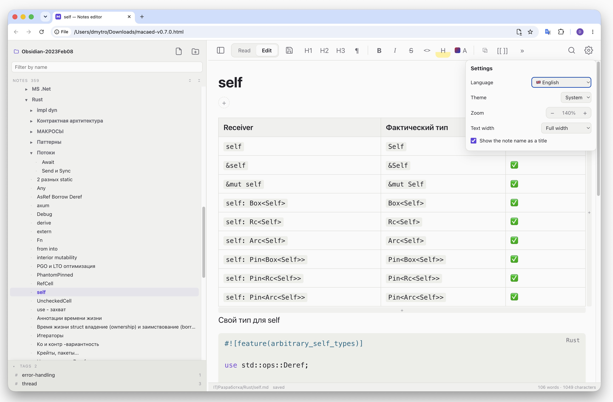

# markdown-catalog-editor

<!-- languages -->
<h3 align="center">
<a href="../../README.md">🇬🇧 English</a> ·
<a href="README.zh.md">🇨🇳 中文</a> ·
<a href="README.hi.md">🇮🇳 हिन्दी</a> ·
<a href="README.es.md">🇪🇸 Español</a> ·
<a href="README.fr.md">🇫🇷 Français</a> ·
<a href="README.ar.md">🇸🇦 العربية</a> ·
<a href="README.bn.md">🇧🇩 বাংলা</a> ·
<a href="README.pt.md">🇧🇷 Português</a> ·
<a href="README.ru.md">🇷🇺 Русский</a> ·
<a href="README.ur.md">🇵🇰 اردو</a> ·
<a href="README.id.md">🇮🇩 Bahasa Indonesia</a> ·
<a href="README.de.md">🇩🇪 Deutsch</a> ·
<b>🇯🇵 日本語</b> ·
<a href="README.tr.md">🇹🇷 Türkçe</a> ·
<a href="README.ko.md">🇰🇷 한국어</a> ·
<a href="README.it.md">🇮🇹 Italiano</a> ·
<a href="README.uk.md">🇺🇦 Українська</a>
</h3>
<!-- /languages -->

ローカルのノートフォルダ向けの Markdown エディタです——精神的には Obsidian に近いものの、す
べてが単一の独立した HTML ファイルに収められています。ネットワークは一切使用しません。ファ
イルはディスクから直接読み込まれ、直接保存されます。

**[オンラインデモ](https://markdown.marketkernel.com/)** —— 同じエディタを PWA
（Progressive Web App）として提供しています。システムにインストールすれば、独自のウィンド
ウとアイコンを持つ別アプリとして動作し、オフラインでも使えます。パソコンでは、Chrome、
Edge、Arc でアドレスバーのインストールボタンを使用します。Android では、Chrome の ⋮ メニュー
→ アプリをインストール。iOS では、Safari または Chrome で「共有」→「ホーム画面に追加」で
す。そちらでもあなたのノートはあなたのディスクに留まり、インストールしたアプリはあなたが指
示したときに更新されます——「[GitHub Pages](#github-pages)」を参照してください。

同じエディタは **Send to Markdown** でもあります。これは [Chrome 拡張機能](#send-to-markdown-chrome-拡張機能)
で、そのボタンのクリック、またはページ上での右クリックによって、ページ——あるいは選択範囲、
リンク、画像——をあなたのフォルダ内のノートへ送ることができ、エディタはページの横、Chrome の
サイドパネルの中に開きます。



```
┌──────────────────────────────────────────────┐
│ Toolbar                                      │
├────────────┬─────────────────────────────────┤
│ File and   │ #tags +                         │
│ folder     │ Document                        │
│ tree       │ (read / edit)                   │
├╌╌╌╌╌╌╌╌╌╌╌╌┤                                 │
│ Tags       │                                 │
└────────────┴─────────────────────────────────┘
```

## 使い方

1. `build/macaed.html` をビルドし（「[ビルド](#ビルド)」を参照）、ブラウザで開きます。
2. 「フォルダを開く」→ `.md` ファイルの入ったフォルダを選びます。フォルダをウィンドウに
   ドラッグするだけでも構いません。
3. 上部の **閲覧 / 編集** 切り替え、または `⌘E`。

Chrome、Edge、Arc では、フォルダは File System Access API を通じて開かれます。ノートはその
場で読み書きされ、ファイルやフォルダの作成、名前変更、削除もすべて機能します。Safari と
Firefox ではフォルダは読み取り専用で開かれ、`⌘S` は変更したファイルのダウンロードを提案しま
す——スマートフォンでも同様です。Android の Chrome には File System Access がなく、iOS 上の
すべてのブラウザ（Chrome を含む）は Safari のエンジン上で動いているためです。

エディタはそこで最近開いた 6 個のフォルダ（ページはフォルダのパスを知ることが一切なく、ブラ
ウザの IndexedDB にフォルダのハンドルを保持します）と、それぞれのフォルダで最後に開いていた
ノートを覚えています。次回の起動時、ブラウザがまだ許可していれば、最後に開いていたフォルダが
自動的に開きます——インストール済みのアプリの場合、あるいは「アクセスのたびに許可」を選んで
いた場合です。それ以外の場合、開始画面には最近使ったフォルダが一覧表示されます。クリック一つ
で、ブラウザが再度アクセス許可を求めます。その一覧に戻るには——フォルダを切り替える、あるい
は新しいフォルダを開くには——ファイルパネル上部のフォルダ名をクリックするか、設定の「フォル
ダを閉じる」を選びます。× を押すと、一覧からそのフォルダが削除されます。

`macaed.html` をノートの隣に置き、HTTP で配信すると、ページはそのフォルダを自動的に認識しま
す——ただし同じ場所に `{ "name": "Notes", "files": ["Note.md", "Folder/Other.md"] }` という形
式の `index.json` が必要です。

## Send to Markdown: Chrome 拡張機能

`npm run build` は `build/extension/` も出力します。Chrome 拡張機能としてのエディタと、
Chrome ウェブストア向けの `build/macaed-extension-<version>.zip` です。リリースにもこの zip
が含まれます。インストール方法：`chrome://extensions` → デベロッパーモード → パッケージ化さ
れていない拡張機能を読み込む → `build/extension`（または展開した zip）。

エディタ自体は Chrome のサイドパネルの中、ページの横に存在し、パネルが狭いためスマートフォ
ン向けのレイアウトで表示されます。タブをまたいでもそこに留まります。フォルダを開く方法はファ
イル版と同じで、最近使ったフォルダも記憶されます——これは拡張機能自身の記録であり、ファイル
版や PWA のものとは別です。拡張機能が追加するのは、ウェブ上のものをあなたのノートへ送る機能
です。

- **ツールバーのボタン**（または `Alt+Shift+M`）はページを送信します。その本文——記事部
  分、サイトのメニューやサイドバー、フッター、共有ボタン、フォーム、隠れた要素を除いたもの
  ——を送ります。ページ上で何かが選択されている場合は、選択範囲のみを送ります。
- ページの**右クリックメニュー**には **ページを Markdown に送信** があります。選択したテキ
  スト上では **選択範囲を Markdown に送信**、リンク上では **リンクを Markdown に送信**、画
  像上では **画像を Markdown に送信** があります。

どちらの方法でもサイドパネルが開き、そこに表示されるダイアログには、届いた内容——ページ、選
択範囲、リンク、画像、そしてどのサイトからのものか——が、まだ編集可能な Markdown として表示
され、どこに保存するかを尋ねられます。

- **新規ノート**、ページの場合のデフォルト：クリップ用フォルダ内に（デフォルトではルートの
  `Clippings`、変更も可能です。このフォルダは記憶され、空欄はルートを意味します）、ページの
  タイトルにちなんで名付けられ、ファイル名に使えない文字は省かれます。既に使われている名前の
  場合は番号が付きます（`Title 2.md`）。ノートはフロントマター——ページのタイトル、アドレ
  ス、日付——から始まり、続いて本文が入ります。保存されると開きます。

  ```markdown
  ---
  title: "The page's title"
  source: "https://example.com/post"
  clipped: 2026-10-07
  ---

  # The page's title

  The text…
  ```

- **開いているノートの末尾**、選択範囲・リンク・画像の場合のデフォルト：空行の後に、送信元
  へのリンクとなる `— [The page's title](https://…)` という行が続きます。リンクの場合はこれ
  は不要です。リンク自体がそのソースだからです。

フォルダを開く前に送信された場合は、待機します。パネルはフォルダを求め、フォルダが開かれた時
点でダイアログが表示されます。拡張機能が読み取れないページ——Chrome 自体のページ、ウェブスト
ア、PDF——は、それへのリンクとして届きます。

**Markdown の内容。** 見出し、段落、**太字**、*斜体*、~~取り消し線~~、==ハイライト==、
`コード`、完全なアドレス付きのリンクと画像、リスト——ネスト、番号付き、タスク——引用、言語情
報付きのコードブロック（`language-…`、GitHub の `highlight-source-…` などから取得）、表
（セル内の改行はエディタ自身の書き方と同じく `<br>` として書かれます）、区切り線。テキストは
そのまま読み取られます。ページ上で入力された `*`、行頭の `#`、`<b>` はすべてエスケープされる
ため、決して書式に変わることはなく、ページの HTML がノートに入り込むこともありません。画像は
ウェブ上に留まり、そのアドレスでリンクされます。遅延読み込み画像の場合はプレースホルダーでは
なく実際のアドレスが取得され、トラッキングピクセルは除外されます。

**権限。** `activeTab`：ボタン、メニュー、ショートカットのクリックによって、その 1 つのタブ
だけが拡張機能に許可され、そこで初めて読み取りが行われます——`scripting` を使って、ページ内
でテキストをコピーして返す関数が実行されます。コンテンツスクリプトはどこでも実行されず、他に
いかなるサイトへのアクセスもありません。`host_permissions` は存在せず、ビルドはこれを拒否し
ます。`contextMenus`、`sidePanel`、`storage`——バックグラウンドのワーカーは取得した内容を、
`chrome.storage.session`（ブラウザを閉じると消えます）を通じてそのウィンドウのパネルに渡
し、パネルの言語はメニューのために `chrome.storage.local` を通じてワーカーに渡されます。拡
張機能のページには `connect-src 'none'` が設定されています。エディタはネットワーク上の何に
も到達しません。ビルドはこれを確認し、またどのページにもインラインスクリプトや外部アドレスが
ないことも確認します。

**実装方法。** パネルはそのページ自体です。`panel.html` とそのスクリプトである `panel.js`
で、これは Manifest V3 が求める形です——同じ `src/main.ts` を使い、`src/platform.ts` の代わ
りに `src/extension/extension.ts` を使います。`src/platform.ts` のフックは、ファイル版と
PWA では何もしません。ワーカーである `background.js` がボタン、ショートカット、メニューを担
当します。Chrome はクリックのハンドラ自体の中で、何かを await する前にしかサイドパネルを開
けないため、ワーカーは先にパネルを開いてから、その後でタブを読み取ります
（`src/extension/grab.ts`）。パネルはその HTML を Markdown に変換し
（`src/extension/to-markdown.ts`）、エディタはそれをどこに保存するか尋ねます
（`src/clip-ui.ts`、`src/clip.ts`）。

## ライブプレビュー

編集モードでは文書は常に書式付きのまま保たれ、キャレットがあるブロックだけが生の Markdown
に変わります。ブロックとは、段落、見出し、リスト全体、コードブロック、引用のことです。リスト
が行ごとにバラバラになることはありません。表は異なる方法で編集されます——「[表](#表)」を参
照してください。

ソース行は書式付きの行と同じフォントサイズ、太さ、行の高さを保つため、テキストが飛び跳ねるこ
とはありません。`# Heading` は見出しの大きさで表示されます。これは自動的にチェックされてい
ます——ブロックを切り替えたとき、50% から 200% までのどのズームレベルでも、その上端の移動量
は 1 ピクセル未満です。

高さが実際に変わる箇所が一つだけあり、これはこのモードでは避けられません。コードブロックは
`` ``` `` の囲みの行が 2 行増えます。その過程で隣接するブロックは動きません——下にあるもの
だけが移動します。

リストの外で Enter を押すと新しいブロックが始まります。ブロックの末尾、または空行で押した場
合は、下に空行が開かれ、キャレットがそこに置かれます。もう一度押すと、さらに行が追加されま
す。Markdown では空行一つだけが 2 つのブロックを区切るため、入力できる空行というのは両側に
空行があるものになります——エディタがその区切り行を自動的に追加するため、入力したテキストが
隣のブロックにくっつくことはありません。こうした空行や、リンク参照定義（`[id]: https://…`）
は編集モードでのみ表示されます。閲覧ビューは Markdown をそのままレンダリングします。

## 表

表が `| pipes |` の形に変わることはありません。クリックするとポインタの下のセルだけが開き、
そのセルは自分自身のテキストを表示します——太字表示ではなく `**bold**` のように——そのため行
内書式やツールバーのマーク、リンク、色がその中でも機能します。入力はファイル内のそのセルだけ
を書き換えます。表の残りの部分は、余白や配置をそのまま保ちます。

- **移動**：Tab と Shift+Tab で次と前のセルへ、Enter で下のセルへ、矢印キーはテキストの端で
  隣のセルへ——そして表の端を越えると、隣接するブロックへ移動します。最終行で Enter を押す
  と、表の下に新しいブロックが始まります。
- **改行**：Ctrl+Enter（または ⌘Enter、Shift+Enter）でセル内に新しい行が始まります。表の 1
  行は Markdown の 1 行であるため、改行は `<br>` として書かれます。編集中のセルではそれが実
  際の改行として表示され、貼り付けたテキストも同じ方法で行が保たれます。複数行あるセルの中
  では、上下の矢印キーはまずその内部の行の間を移動します。セル内のテキストは上端に揃えられ
  ます。
- **追加**：編集モードで表の上にポインタを乗せると、下に **+** の付いたバーが表示され、これ
  で行を追加できます。右側の **+** で列を追加できます。最後のセルで Tab を押しても行が追加
  されます。
- **削除**：空の行・列のみが削除されるため、うっかり操作でテキストが失われることはありませ
  ん。空の行にポインタを乗せるとその左に **×** が、空の列に乗せるとその上に **×** が表示さ
  れます。空のセルで Backspace を押すとキーボードから同じ操作ができます。行全体が空であれば
  その行を、そうでなく列全体（ヘッダーを含む）が空であればその列を削除します。文字が一切残っ
  ていない表はまるごと削除されます。ヘッダー行は残ります——表には必ず 1 つ必要です。

追加や削除を行うと、表はプレーンな `| a | b |` 形式に書き直されます。

## タグ

タグはフォルダをまたいでノートをグループ化します。タグはノートには書き込まれません。
Markdown は元のまま保たれ、フォルダの全タグはノートの隣にある 1 つのファイルに収められてい
ます。

- **ノート上**：タグはタイトルの下に `#tag` のチップとして並び、その後に **+** が続きま
  す。**+** は入力欄に変わります。Enter でタグが追加され、その後に **+** が再び現れます。そ
  のフォルダで既に使われているタグは、入力中に候補として提案されます。Esc でキャンセル。テ
  キストが入った状態で入力欄からフォーカスを外しても、タグは追加されます。チップの **×** は
  タグを削除し、チップをクリックするとそのタグのページが開きます。タグは閲覧モード・編集
  モードのどちらでも変更できます。
- **表記**：先頭の `#` は取り除かれ、タグ内のスペースはハイフンになります。そのため
  `#to do` は `to-do` として保存されます。既存のタグと大文字小文字だけが異なるタグは、既存
  の表記になります——`Idea` と `idea` が 2 つのタグになることはありません。1 つのノートが同
  じタグを 2 回持つことはできません。
- **ネスト**：`/` でタグをネストできます。`work/alpha` と `work/beta` はタグツリー内で
  `work` の下に置かれ、`work/alpha` が付いたノートは `work` の下にもカウントされます。
- **タグツリー**：ファイルパネル下部にある、ファイルツリーとは別のセクションです。各タグに
  は、それ自体またはその下にネストされたタグが付いたノートの数が表示されます。親タグの矢印
  はその子を折りたたみ、見出しはセクション全体を折りたたみます。ファイルツリー上の名前フィ
  ルターはタグにも適用されます。このセクションはパネルの最大 42% を占め、内部でスクロールし
  ます。その上の線をドラッグすると高さを低くできます（高くすることはできません）。その線をダ
  ブルクリックするとスペースが元に戻り、その線にフォーカスがある状態では ↑ と ↓ でも同じこ
  とができます。高さは記憶されます。
- **タグのページ**：ツリー内のタグ、またはチップをクリックすると、そのタグが付いたノートが
  表示されます——親タグの場合は、その下にあるすべてのタグのノートも一覧表示されます。各行に
  はノートの名前、フォルダ、すべてのタグが表示されます。名前をクリックするとノートが開き、タ
  グをクリックするとそのタグが開きます。このページは読み取り専用で、編集できるものは何もな
  く、書式ツールバーもオフになります。ネストされたタグの場合、そのタイトル内の親タグはそれ
  ぞれ自分自身のページにリンクします。
- **名前の変更と削除**：ファイルパネルからノート、またはフォルダ内のすべてのノートの名前を
  変更したり削除したりすると、タグもそれに従います。エディタの外で移動または削除されたノー
  トは、ファイル内のエントリをそのまま保持しますが、ノートが見つからない間は、そのエントリ
  は表示もカウントもされません。
- **読み取り専用フォルダ**（Safari、Firefox）：タグは表示されますが、**+** と **×** は表示
  されません。

### `.meta.json`

このファイルは開いたフォルダのルートに置かれ、最初のタグが作られたときに作成されます。ファ
イルツリーには決して表示されません。

```json
{
  "notes": {
    "Ideas.md": { "tags": ["idea", "work/alpha"] },
    "Projects/Roadmap.md": { "tags": ["work/alpha", "planning"] }
  }
}
```

キーはツリーに表示されているとおりの、ルートからの相対パスです。タグは追加された順序を保ち
ます。ファイルはノートをパス順に並べ、2 スペースのインデントで書き込まれるため、差分
（diff）でも読みやすく、タグが一つも残っていないノートはファイルから取り除かれます。エディ
タが認識しないフィールドは——最上位にあるものでも、ノートのエントリ内にあるものでも——ファイ
ルを書き戻す際にそのまま保持されるため、他のツールもそこに独自のデータを保存できます。この
ファイルが有効な JSON オブジェクトでない場合、エディタはその旨を表示し、タグを一切表示せ
ず、決して上書きしません。ファイルが修正され、フォルダが再度開かれるまで、タグは変更できま
せん。

フォルダが `index.json` を伴って HTTP で配信される場合（「[使い方](#使い方)」を参照）、タグ
を表示するには `.meta.json` もそのファイル一覧に加えてください。

## HTML に書き出す

ツールバーの書き出しボタン（「保存」の隣）は、フォルダ全体を静的サイトに変換します。フォル
ダの右クリックメニューにある **HTML に書き出す…** は、そのフォルダだけに対して同じ処理を行
い、ツリー下の空白部分で使うとフォルダ全体に対して行われます。サイトはノートフォルダのルー
トにある `output/<folder>/` に書き出されます。フォルダ名は書き出した瞬間の日時にちなんで
`2025-12-31_23-33-33` のように付けられ、ダイアログで名前を変更することもできます。
`output` はファイルツリーに表示されることはありません。書き込み用に開かれたフォルダのみ書き
出すことができます。

書き出しの実行中、ダイアログは現在の段階——ノートの読み込み、ページの書き込み、画像のコ
ピー——を進捗バーとともに表示し、閉じることはできません。**中止** を押すと、すでに処理中の
ファイルが終わった時点で書き出しが終了し、それまでに書き込まれた内容がそのまま残ります。書
き出しが完了するまで、書き出しボタンとメニュー項目は無効になります。ファイルは複数ずつまとめ
て読み書きされ、途中にある各フォルダは一度だけ作成されます。終了時には書き出しはディスクから
フォルダを読み直します。ファイルが不足していれば、ダイアログはその数と名前を一つ伝えます。空
のフォルダに対して成功を報告することはありません。

**静的サイトを作成**——デフォルトで有効——はノートごとに 1 ページを作成します（詳細は後
述）。これを無効にすると、書き出し結果はすべてのノートを含む 1 つのページ `index.html` にな
ります。左側パネルは目次になり、各ノートは 1 つのセクションとしてその名前が上に表示され、見
出しは 1 段階下がり、その id にはノートの名前が接頭辞として付けられます。そのため、ノート間
のリンクやその見出しへのリンクは、ページ内のアンカーになります。ページは一度に 1 つのノート
だけを表示します——アドレスの `#anchor` が指す、またはその中にあるノート、最初はルートの
`index` または `README`、それがなければルートにある最初のノートです。目次、リンク、検索結
果、各ノート末尾の **前へ**／**次へ** リンクがノート間の切り替えを行います。これは CSS
（`:target`）で実現されているため、スクリプトがなくても機能します。スクリプトは目次の中で表
示中のノートに印を付けるだけです。印刷するとすべてのノートが表示されます。ブラウザ自体の検索
機能（`⌘F`）は表示中のノートしか見えません——検索欄はすべてのノートを検索します。タグを使っ
ている場合、パネル内のタグツリーとノート上のチップは末尾のタグセクションへつながり、タグご
とに見出しとそのノートが並びます。このページは単一ファイルで、スタイルシートとスクリプトは
その中に書き込まれます。画像だけは別で、`assets` フォルダにまとめられ、元のフォルダ構成は保
たれますが、各ノート自身の `assets` という段階は保たれません。`docs/assets/Guide/a.png` は
`assets/docs/Guide/a.png` になります。この単一ページには、サイト版と同じ検索、テーマボタ
ン、**すべて展開**／**すべて折りたたむ** ボタン、幅を変更できるパネルがあります。検索はペー
ジ自体から直接ノートを読み取り、結果をクリックするとそのノートへジャンプします。

本文の幅と、ノートの上に表示される名前は、書き出し時点でのエディタの設定に従います。**テキ
ストの幅** をペイン全体に設定すると、全幅のページになり、**ノート名をタイトルとして表示** を
オフにすると、ノートの上に名前は追加されません。

ページはそのテキストとプレーンな相対リンクをすべて持ち、後から読み込まれるものは何もありま
せん。サイトは `file://` の URL からでも、どんな Web サーバーからでも、また検索エンジンから
も開けます——各ページには `<title>`、最初の段落から取られた `<meta name="description">`、
`lang`、そして 1 つの `<h1>` があります。ナビゲーション内のフォルダは `<details>` で折りたた
まれます。テーマはシステムに従います。

`site.js` という小さなスクリプトが、HTML だけでは実現できないものを追加します。

- **検索**：左側パネルの上部にある入力欄です。ノートの名前、フォルダ、本文に入力された単語
  すべてを検索します。検索結果はツリーの代わりに表示されます——まず一致した名前が表示され、
  それぞれに見つかった単語の周囲のスニペットが強調表示付きで添えられます——欄をクリアする
  （Esc）とツリーが戻ってきます。Enter で最初の結果を開き、↓ と ↑ で一覧を移動します。検索
  用のテキストは `search.js` から取得され、これは欄が初めて使われたときにスクリプトが読み込
  みます。そのため、ページ自体は軽いままです。
- ナビゲーション上部の「ノート」の隣にある **すべて展開** と **すべて折りたたむ**。
- サイト名の隣にある **テーマ** ボタン：月のアイコンはダークテーマへ、太陽のアイコンはライ
  トテーマへ切り替えます。システムが何を好むかに関わらずです。押されるまでは、テーマはシス
  テムに従います。
- パネルの右端にあるハンドルで、幅を広くしたり狭くしたりできます（160〜560 px、ダブルクリッ
  クでデフォルトに戻ります。ハンドルにフォーカスがある状態では ← → でも移動できます）。

テーマ、カラムの幅、各フォルダの展開状態は、同じサイト内のページ間で記憶されます。表示中の
ページが属するフォルダは常に開いた状態になります。スクリプトがない場合——ブロックされた場
合、あるいはテンプレートから取り除かれた場合——検索欄、各種ボタン、ハンドルは単に存在しなく
なり、テーマはシステムに従い、サイトの読み取りとリンクの動作は変わりません。

- **ページ**：`dir/Note.md` は `dir/Note.html` になります。自分自身の名前と同じ見出しで始
  まるノートは、その見出しがページのタイトルになり、その下にタグが表示されます。`index` ま
  たは `README` という名前のルートノートはトップページ `index.html` になります。そのような
  ノートがなければ、トップページにはノートとタグの一覧が表示されます。`[text](other.md)` と
  `[[wiki links]]` は対応するページを指し、`[[Note#Heading]]` は見出しを指します——すべての
  見出しには id が付いています——そして、書き出しに含まれていないノートへのリンクは、プレー
  ンテキストのまま残ります。タスクのチェックボックスは表示されますが、クリックはできませ
  ん。フロントマターは除かれます。
- **画像**：フォルダ内のすべての画像と PDF は同じパスにコピーされるため、`![[image.png]]`
  と `` の両方が動作し続けます。埋め込みはエディタが見つけるのと同じ場所で
  見つかります。
- **タグ**：**タグをエクスポート** のチェックボックスをオンにすると、各ページに自身のタグ
  が表示され、タグツリーはナビゲーションの下に置かれ、タグごとのページにそのタグの付いた
  ノートが一覧表示されます——親タグの場合はその下にあるすべてのタグのノートも含みます——さ
  らに `tags/index.html` にタグの索引が作られます。カウントされるのは書き出しに含まれるノー
  トのみです。
- **テンプレート**：ダイアログにページテンプレートが表示されます。そこで編集するか、**既定
  に戻す** を選ぶことができ、変更内容は記憶されます。テンプレートは `{{プレースホルダー}}`
  を含む HTML です。

  | プレースホルダー | 意味 |
  | --- | --- |
  | `{{navigation}}` | `<nav>` としてのフォルダツリー、現在のページには印が付く——必須 |
  | `{{heading}}` | ページの `<h1>`。ノート自身に見出しがある場合は空——必須 |
  | `{{content}}` | HTML としてのノート本文——必須 |
  | `{{tags}}` | `<nav>` としてのタグツリー。タグを書き出す場合に必須、それ以外は空 |
  | `{{pagetags}}` | ノートのタグ。それぞれのページへリンクする `#チップ` として |
  | `{{title}}` | `<title>` 用の、プレーンテキストのページ名 |
  | `{{site}}` | 書き出したフォルダの名前 |
  | `{{description}}` | `<meta name="description">` 用の、最初の段落のプレーンテキスト |
  | `{{width}}` | テキスト幅の設定による `full` または `column` |
  | `{{root}}` | ページが属するフォルダの階層ごとの `../`。`{{root}}style.css` でルートに届きます |
  | `{{styles}}` | スタイルシート：サイトでは `style.css` への `<link>`、単一ページでは完全な `<style>` |
  | `{{script}}` | スクリプト：サイトでは `site.js` への `<script src>`、単一ページでは完全な `<script>` |
  | `{{theme}}` | ライト／ダーク切り替えボタン |
  | `{{path}}` | ノートのパス。`docs/Note.md` のような |
  | `{{lang}}` | `<html lang>` 用のインターフェース言語 |

  テンプレートがそれらを使っているかどうかに関わらず、サイトのルートには `style.css`、
  `site.js`、`search.js` が置かれます。単一ページの場合はスタイルシートとスクリプトを内部に
  持ちますが、そのテンプレートが `{{styles}}` が導入される前に保存されたもので、まだ
  `style.css` をリンクしている場合にのみ、隣に `style.css` が置かれます。デフォルトのスタイ
  ルシートはノートをエディタの閲覧ビューと同じ見た目にし、`<html data-width="{{width}}">`
  から幅を読み取ります。書き出し処理が認識しないプレースホルダーはそのまま残されます。新し
  いプレースホルダーが登場する前に保存されたテンプレートはそれを使用しません。**既定に戻す**
  で取り込まれます。

## プライバシーとセキュリティ

- **ページは何にも到達しません。** ファイル内のコンテンツセキュリティポリシーは、そのコー
  ドが同じサーバー上の隣接するファイル以外を取得することを許しません（`index.json` で配信
  されるフォルダの場合は `connect-src 'self'`）。また、どこにもフォームを送信しません。ポリ
  シーが欠けていたり、外部参照が紛れ込んでいたりすると、ビルドは失敗します。PWA 版のポリシー
  は、自身のオリジンからのマニフェストとサービスワーカーのみを許可します。
- **ノート内のスクリプトは決して実行されません。** ノートには HTML を含めることができます
  ——文字の色はこの仕組みで実現されています——そのため、このポリシーはエディタ自身のスクリ
  プト 1 つだけを、そのハッシュによって許可します。ノート内の `` の `onerror` や
  `<script>` は何も行いません。
- **ノートがウェブ上でリンクしているものは、そこから読み込まれます**：`https://` アドレス
  を持つ画像、動画、埋め込みフレームなど、どんな Markdown ビューアでも同様です——これはノー
  ト自身の選択であって、エディタの選択ではありません。こうしたリクエストに `Referer` は付き
  ません。
- **ファイルは常にあなたのディスク上にあります。** ノートは File System Access API を通じ
  てその場で読み書きされます。記憶されたフォルダはブラウザの IndexedDB 内のハンドルであり、
  パスや内容そのものではありません。
- 拡張機能の権限については、「[Send to Markdown](#send-to-markdown-chrome-拡張機能)」を参
  照してください。

## 機能

- **ファイルツリー**：折りたたみ可能なフォルダ、名前による絞り込み、右クリックメニューから
  の作成・名前変更・削除、幅を変更できるパネル、パネルの非表示（`⌘\`）。
- **選択範囲の書式設定**：見出し H1〜H3、太字、斜体、取り消し線、等幅、`==…==` ハイライ
  ト、文字色と背景色、リンク、`[[wiki リンク]]`、リスト、タスク、引用、コードブロック、
  表、区切り線。
- **マークアップ**：CommonMark に加えて、表、クリック可能なチェックボックス付きのタスク、
  `==ハイライト==`、`[[wiki リンク]]`、フロントマター、19 言語分のシンタックスハイライト、
  フォルダ内の画像。
- **画像**：`` は、ノートのフォルダからの相対パスで画像を表
  示します。Obsidian 形式の `![[assets/Note/image-1.png]]` も機能し、パスはノートのフォルダ
  からでも、ルートからでも構いません（`![[…|300]]` で幅を指定できます）。裸の名前による古い
  形式の埋め込み `![[image-1.png]]` は、設定の画像フォルダの中で、ノートのサブフォルダ付き
  とそれなしの両方、`assets/<ノート名>/`、ノートの隣、という順に探され、最後に Obsidian と
  同様にフォルダ内のどこでも名前で検索されます。画像フォルダはツリー内でデフォルトでは折り
  たたまれています。ノートの名前を変更すると、その画像フォルダの名前も変更され、ノート内の
  画像へのリンクも、どちらの形式であっても新しいパスに変更されます。ツリー内で画像をクリッ
  クすると、テキストとしてではなく画像として開きます。
- **画像の追加**：ツールバーの画像ボタンで画像ファイルを選択できます。`⌘V` で画像を貼り付
  けた場合も——スクリーンショット、ブラウザ内でコピーした画像、ファイルマネージャーでコピー
  したファイル——同じ方法で追加されます。どちらの場合も、ノートの隣にある画像フォルダ（デ
  フォルトは `assets/<ノート名>/`）に保存され、どんなエディタでも表示できるプレーンな
  Markdown として、そのパス（``、パス内のスペース
  は `%20` と書かれます）とともに挿入されます：キャレットの位置に、あるいはブロックが開いて
  いない場合はノートの末尾に挿入されます。ノート上にドラッグされた画像は、落とされた場所に
  挿入されます。ブロックやテーブルセルの中のその位置、テキストの隣、または 2 つのブロックの
  間——その場合は上のブロックの末尾に挿入されます。閲覧モードでのドロップは編集モードへの切
  り替えとなり、ノートの外でのドロップは画像を末尾に追加します。フォルダを含むドロップでも、
  そのフォルダが開かれます。貼り付けたスクリーンショットは `image-1.png`、`image-2.png` と
  順に名付けられます。選択したファイルは元の名前を保ち、重複する場合は番号が付きます。スプ
  レッドシートからコピーしたセルは、それに付随する画像ではなく、テキストとして貼り付けられ
  ます。新しい画像を受け入れるのは、書き込み用に開かれたフォルダのみです。
- **タグ**：ノート上のネストされたタグ、タグツリー、タグごとのページがあり、ノートとは別に
  `.meta.json` に保存されます——「[タグ](#タグ)」を参照してください。
- **HTML に書き出す**：フォルダ、またはそのサブフォルダの一つを、検索付きの静的サイトとし
  て、あるいは単一ページとして書き出します——「[HTML に書き出す](#html-に書き出す)」を参照
  してください。
- **Send to Markdown**：Chrome 上のページ、選択範囲、リンク、画像を Markdown としてノート
  へ送ります——「[Send to Markdown](#send-to-markdown-chrome-拡張機能)」を参照してくださ
  い。
- **設定**（右上、検索の隣にある歯車アイコン）：インターフェース言語、テーマ（システム、ラ
  イト、ダーク）、50〜200% のズーム、テキストの幅（中央寄せのカラムか全幅か）、ノート名をタ
  イトルとして表示するかどうか、追加した画像の保存先——ノートの隣の画像フォルダ（デフォルト
  は `assets`）と、ノートごとに専用のサブフォルダを作るかどうか。作らない場合、すべての画像
  はそのフォルダに直接入ります。下部にはバージョン——そしてインストール済みのアプリでは、更
  新の確認と、更新を自動的にインストールするかどうかの設定があります。
- **言語**：英語と、さらに 16 の言語——中文、हिन्दी、Español、Français、العربية、বাংলা、
  Português、Русский、اردو、Bahasa Indonesia、Deutsch、日本語、Türkçe、한국어、Italiano、
  Українська。デフォルトでは、インターフェースはブラウザの言語に従います。アラビア語とウル
  ドゥー語では、外枠が右から左に鏡像表示されます。ノート自体は自身の方向を保ちます。
- **スマートフォン**：幅が 720 px より狭い画面では、ファイルパネルがノートの上にスライドし
  て重なります——☰ で開き、ノートを選ぶかその隣をタップすると閉じます——ツールバーは 1 行に
  収まります。書式設定は編集モードでのみ 2 行目を使います。書き出し機能はここでは省かれま
  す。タッチスクリーンでは、入力欄は少なくとも 16 px あるため iOS がズームインすることはな
  く、ツリーの行も高くなります。デスクトップのレイアウトと、記憶されているパネル幅はそのま
  まです。
- 編集の 1 秒後に自動保存、元に戻す・やり直し、ノート内検索。
- 言語、テーマ、ズーム、テキストの幅、パネルの幅、タグパネルの高さ、最後に開いたノートが記
  憶されます。

## キーボードショートカット

| 操作 | キー |
| --- | --- |
| 閲覧 / 編集モード | `⌘E` |
| 保存 | `⌘S` |
| ノート内を検索 | `⌘F` |
| ファイルパネル | `⌘\` |
| ズーム | `⌘+` · `⌘−` · `⌘0` |
| 太字 · 斜体 · リンク | `⌘B` · `⌘I` · `⌘K` |
| 等幅 · ハイライト · wiki リンク | `⌘⇧C` · `⌘⇧H` · `⌘⇧K` |
| 見出し 1〜6 · 本文 | `⌘⌥1`…`⌘⌥6` · `⌘⌥0` |
| 元に戻す · やり直し | `⌘Z` · `⌘⇧Z` |
| リストのインデント | `Tab` · `⇧Tab` |
| ブロックを離れる | `Esc` |

## 翻訳

英語のテキストはコード内に残ります：`t('tree', 'Delete')`、`tn('status', '{count} word',
'{count} words', n)`、そしてテンプレート内の `data-i18n="context"` /
`data-i18n-attr="context"`。最初の引数はコンテキストです——そのストリングがインターフェース
のどの部分に属するかを表し、これにより同じ英単語を 2 つの場所で別々に翻訳できます。辞書であ
る `src/locales/<code>.json` は、コンテキスト → 英語テキスト → 翻訳、という形でマッピング
します。

```json
{
  "tree": { "Delete": "Удалить" },
  "status": { "{count} words": { "one": "{count} слово", "few": "{count} слова", "many": "{count} слов", "other": "{count} слова" } }
}
```

辞書にないストリングは英語のまま表示されます。数値を含むテキストには、その言語の複数形のカ
テゴリ（`Intl.PluralRules`）ごとに 1 つの形があり、英語の複数形をキーとして使います。
`npm run i18n` は、言語ごとにまだ翻訳されていないストリングと、もう使われなくなったストリン
グを一覧表示します。`npm test` は、すべての翻訳が英語のプレースホルダーを保っているか、すべ
ての複数形を持っているかを確認します。

Chrome が拡張機能自体について表示する内容——名前と説明、ツールバーボタンのタイトル——は、パ
ネルの言語ではなく、`chrome.i18n` を通じてブラウザの言語に従います。これらのテキストは
`src/extension/manifest.json` 内の英語のテキストであり、同じ辞書内の `manifest` というコン
テキストで翻訳されます。ビルドはそれらを `_locales/<code>/messages.json` に書き出し、
`__MSG_appName__` のようなものをマニフェストに入れます。Chrome には独自のコードがあり、それ
以外は無視されます。`pt` は `pt_BR` と `pt_PT` になり、`zh` は `zh_CN` になります。ウルドゥー
語にはコードがないため、その場合 Chrome は英語で拡張機能を説明します。ビルドは名前が 75 文
字を超える、または説明が 132 文字を超える場合に停止します。右クリックメニューは、パネルが一
度開かれた後はパネルの言語で、それ以前はブラウザの言語で話します。

この README も翻訳されています：`docs/readme/README.<code>.md`、言語ごとに 1 つずつ、それ
ぞれの先頭に言語の一覧があります。ここでの変更は、翻訳にも反映されるべきです。

## ビルド

```sh
./build.sh         # installs the dependencies if needed, then builds
npm install
npm run build      # -> build/macaed.html, build/pages/, build/extension/ and its zip
npm run watch      # rebuild on changes in src/ and assets/
npm run typecheck  # tsc --noEmit
npm test           # the block model, formatting, Markdown syntax, tags, the export, clippings and the dictionaries
npm run test:browser  # in headless Chrome: the editor, HTML → Markdown, the PWA, the extension
npm run i18n       # strings each dictionary lacks or no longer needs
npm run check      # typecheck, test, build and test:browser in a row: green means done
```

`build.mjs` は esbuild を使って `src/main.ts` を 1 つの IIFE にバンドルし、スタイルとアイコ
ン（data URI）とともに `src/template.html` に埋め込みます。書き出し機能のテンプレートとス
タイルシートは文字列としてバンドルされます。テンプレートのコンテンツセキュリティポリシー
は、その 1 つのスクリプトのハッシュ値を得ます。結果として得られるのが `build/macaed.html`
で、約 620 KB です。外部参照が 1 つでも残っていれば、ビルドは失敗します。

同じ実行で `build/pages/` も書き出されます。そのページをインストール可能な PWA にしたも
の——マニフェストへのリンクと、ページにワーカーの登録を伝える `<meta
name="service-worker">` を持つ `index.html`、`manifest.webmanifest`、各アイコン、そしてオ
フラインで開けるようページをキャッシュする `sw.js` です。`build/macaed.html` 自体は、外部参
照を一切持たない単一ファイルのままです。

そして `build/extension/`：`panel.html`——テンプレート本体、そのスクリプトは
`panel.js`——`background.js`、各アイコン、`_locales/`、そして `manifest.json`（バージョンは
`package.json` のものです）。`build/macaed-extension-<version>.zip` は同じファイルを固定日
時で保持します。同じソースからは常に同じバイト列が生成されます。

ブラウザテストはローカルの Chrome を起動し（`CHROME=/path/to/chrome` で選択可能）、依存関
係なしに DevTools プロトコルで通信します。Chrome がなければスキップされます。
`tools/test-extension.mjs` は、そのプロトコルを通じて拡張機能を読み込み（パイプ越しの
`Extensions.loadUnpacked`。`--load-extension` は Chrome 137 以降廃止されています）、サイド
パネルでフォルダを開き、ローカルサーバー上のテストサイトからページ、選択範囲、リンク、画像
を送信します。ツールバーのボタンも右クリックメニューも DevTools からクリックすることはでき
ないため、テストはワーカーの `onClicked` を自ら発火させます。実際のクリックがないため
Chrome は `activeTab` を付与しません。そのため、テスト対象のコピーはテストサイト
`*.test` にホスト権限としてアクセスする場合があります。

## バージョンとリリース

バージョンは 1 か所、`package.json` にのみ書かれています。ビルドはこれをページ（開始画面の
下の行、設定の下部）、拡張機能の `manifest.json`、そして PWA のキャッシュ名に書き込みます。
`v<version>` タグが付いたコミットのビルドはそのままの形で表示されます。それ以外のビルドは
コミットが付加され、`0.11.0+1a2b3c4` のようになります。これにより、GitHub Pages 上の
`main` ブランチからのページが、リリースと誤認されることはありません。Chrome の `version` は
数字しか保持できないため、そこではコミットは `version_name` に入ります。

```sh
npm version minor           # 0.11.0 -> 0.12.0: package.json, package-lock.json, a commit and the tag v0.12.0
git push --follow-tags      # the tag starts .github/workflows/release.yml
```

リリースワークフローは、タグと `package.json` が一致しない場合は停止します。テストを実行し
た後、`macaed-<tag>.html`、`macaed-extension-<tag>.zip`、`SHA256SUMS.txt` を添付します。

## GitHub Pages

`.github/workflows/pages.yml` は `main` へのすべてのプッシュをビルド・テストし、
`build/pages/` を GitHub Pages にデプロイします（Settings → Pages → Source: GitHub
Actions）。公開先は <https://marketkernel.github.io/markdown-catalog-editor/> です。
Chrome、Edge、Arc ではアドレスバーのインストールボタンで、別アプリのウィンドウになります。
iOS では「共有」→「ホーム画面に追加」です。フォルダは単一ファイル版と同じ方法で開きます。

**オフライン。** 一度開けば、エディタは接続なしでも動作します。サービスワーカーがページ、
マニフェスト、アイコンをバージョン名の付いたキャッシュに保持し、そこからページを提供しま
す。ノートが経由することは決してありません——それらはあなたのディスク上にあります。

**更新。** デプロイのたびに `sw.js` が変わるため、ブラウザは自力で新しいワーカーを見つけま
す——接続のある状態での起動時、アプリが開いたままの状態で数時間ごと、接続が復帰したとき、あ
るいは設定の「更新を確認」が求めたときです。新しいワーカーは自身のバージョンを専用のキャッ
シュにダウンロードして待機します。実行中のワーカーは古いページを提供し続け、オフライン時も
同様です。そのため、あなたの手の中で何かが変わることはありません。このとき、設定（そのボタ
ンにはドットが付きます）と開始画面には「バージョン … の準備ができました。更新」と表示されま
す。更新を押すと、開いているノートが保存され（保存できない場合は確認が求められます）、新し
いワーカーが引き継いでページが再読み込みされ、更新が完了したことが一度だけ表示されます。古
いキャッシュは削除されます。ボタンを押さなくても、アプリのすべてのウィンドウが閉じられた時
点で新しいバージョンが開始します——あるいは、設定の「すべて保存済みでアプリがバックグラウ
ンドにあるとき、更新を自動的にインストールする」をオンにしていれば、未保存のものがなく、ウィ
ンドウが見えなくなった時点ですぐに開始します。

これはトレードオフでもあります。インストール済みの PWA は、最新のデプロイが置いたものを常
に実行する一方、ダウンロードしたファイルはそのままのバージョンにとどまります。ディスク上に
固定されたバージョンが必要な場合は、リリースから `macaed-<tag>.html` を取得し、
`SHA256SUMS.txt` と照合してください。

インストール済みのアプリは、ブラウザにそのストレージを保持するよう求めます
（`navigator.storage.persist()`）。そうしないと、ディスク容量が逼迫したときに、オフライン
のコピーと記憶されたフォルダが一緒に失われることがあります。

`npm run test:browser` は `build/pages/` も開きます（`tools/test-pwa.mjs`）。サービスワー
カーがページを引き継ぎ、Chrome はマニフェストをインストール可能と判断し、サーバーがなくなっ
てもページは読み込まれ続けます。続いて、更新なしの確認、接続なし、そして新しいデプロイの順
でテストされ、最後のものは「更新」がそれを通すまで待機します。

## レイアウト

```
src/template.html   markup with the __STYLES__/__APP__/__ICON__ placeholders and the CSP
src/styles.css      palette, light and dark themes, block paired with its source
src/main.ts         opening a folder, saving, toolbar, search, settings
src/vault.ts        File System Access API, drag-and-drop, webkitdirectory; file CRUD
src/editor.ts       live preview: active block, caret, Enter, joining, undo
src/blocks.ts       splitting the document into blocks by markdown-it tokens
src/format.ts       toolbar actions as pure text transforms
src/markdown.ts     markdown-it: ==highlight==, [[wiki links]], ![[embeds]], tasks, code highlighting
src/tree.ts         folder and file tree
src/meta.ts         .meta.json: tags per note, the tag tree, renames and deletes
src/tags.ts         the tag tree, the tags under a note's title, a tag's page
src/export.ts       the static site: pages, navigation, tag pages, links between them
src/export-ui.ts    the export dialog and its progress
src/export-script.ts   site.js: search, expand/collapse all and the resizable column on the exported site
src/export-template.html, src/export.css   the default page template and its stylesheet
src/settings.ts     localStorage: language, theme, zoom, panel width, last note
src/i18n.ts         t()/tn(), the language list and flags, translating the page's markup
src/locales/        one dictionary per language
src/ui.ts           dialogs, context menu, popover, notifications
src/update.ts       the installed app's updates: the waiting worker, its version, Update
src/platform.ts     what the page does beyond itself: nothing, except in the extension
src/clip.ts         what the extension sends, as a note: file name, front matter, the end of a note
src/clip-ui.ts      the dialog that asks where it goes
src/pwa/sw.js       the service worker of the Pages build: offline, and a new version waits
src/extension/      "Send to Markdown": manifest.json; background.ts (button, shortcut, menu);
                    grab.ts (run in the page: its text or the selection); to-markdown.ts
                    (HTML → Markdown); extension.ts (in the place of platform.ts); messages.ts
tools/              build helpers (load.mjs, i18n.mjs, chrome.mjs) and the tests: block model,
                    formatting, tags, the export, clippings, dictionaries; in headless Chrome
                    the editor, HTML → Markdown, the PWA and the extension
assets/             icon.svg; pwa/ its PNG sizes for the PWA; extension/ the extension's icons
docs/               the README screenshot and its translations, docs/readme/
build/macaed.html   the build output
build/pages/        the PWA for GitHub Pages
build/extension/    the Chrome extension, and build/macaed-extension-<version>.zip of it
```

## 制限事項

- 共同編集、プラグイン、同期、リンクグラフはサポートされていません。
- スマートフォンでは、レイアウトは閲覧向けに作られています。ツリーの右クリックメニューには
  長押しが必要ですが、iOS はこれを長押しとして扱いません。また、表の拡張用バーはホバー時に
  のみ表示されます。
- ファイルを書き込めるのは Chromium ベースのブラウザのみです。
- この拡張機能は Chrome（および Edge のような、サイドパネルを持つ Chromium ベースのブラウ
  ザ）向けです。まだ Chrome ウェブストアには掲載されていません。画像はフォルダにダウンロー
  ドするのではなく、ウェブ上に置いたままにします。ダウンロードするにはすべてのサイトへのア
  クセス権が必要になるためです。

## ライセンス

MIT —— [LICENSE](../../LICENSE) を参照してください。
